 

**واجهات أنيقة. أنظمة مترابطة. منتجات تُستخدم.**

أطوّر تطبيقات الويب والجوال وويندوز، مع اهتمام بتجربة المستخدم والتفاصيل التي تجعل المنتج واضحًا وسهل الاستخدام.

MODE &nbsp; / &nbsp; Forest Edge &nbsp; / &nbsp; Saudi Arabia

 

## أعمال مختارة

ثلاث تجارب مختلفة، واهتمام واحد: بناء أدوات عملية بواجهات واضحة.

<table>
<tr>
<td width="33%" valign="top" dir="rtl">

### 01 &nbsp; رَدّ

**تصحيح لوحة المفاتيح**

تطبيق ويندوز يعيد النص المكتوب بتخطيط خاطئ إلى العربية أو الإنجليزية باختصار واحد، مع واجهة ثنائية اللغة ومعالجة محلية.

Windows · Tauri · Rust · React

  

<a href="https://apps.microsoft.com/detail/9N00D9M9T5L8"><strong>Microsoft Store ↗</strong></a>

</td>
<td width="33%" valign="top" dir="rtl">

### 02 &nbsp; نَسَق

**مساحة عمل للمستندات**

تطبيق ويندوز يجمع تحويل المستندات وتنظيم PDF والتوقيع وOCR والطباعة والمسح الضوئي، مع محركات معالجة محلية.

Windows · Tauri · TypeScript

  

<a href="https://github.com/moode774/Nasaq"><strong>استكشف التطبيق ↗</strong></a>

</td>
<td width="33%" valign="top" dir="rtl">

### 03 &nbsp; متجر

**منظومة تجارة إلكترونية**

منصة تربط تجربة العميل بإدارة التاجر ومهام المندوب ولوحة الإدارة، من تصفح المنتجات إلى متابعة الطلبات والتوصيل.

React Native · Expo · Supabase

  

<a href="https://github.com/moode774/electron-store-app"><strong>استكشف المشروع ↗</strong></a>

</td>
</tr>
</table>

 

## ما أبنيه

| المجال | التركيز |
|:---|:---|
| **تطبيقات الويب** | واجهات متجاوبة، لوحات إدارة، ومنصات أعمال. |
| **تطبيقات ويندوز** | أدوات عملية، تكامل مع النظام، ومعالجة محلية. |
| **تطبيقات الجوال** | تجارب مترابطة باستخدام React Native وFlutter. |
| **خدمات الخلفية** | بيانات، مصادقة، واجهات API ومنطق تشغيل. |

## التقنيات

**Frontend** &nbsp; React · TypeScript · Next.js · Tailwind CSS  
**Desktop & Mobile** &nbsp; Tauri · Rust · React Native · Expo · Flutter  
**Backend & Data** &nbsp; Node.js · Python · Supabase · Firebase

 

## من أعمالي أيضًا

| المشروع | الفكرة |
|:---|:---|
| [**Forest Edge Pro**](https://github.com/moode774/Forest-Edge-Pro) | نظام أعمال يجمع الواجهة وخدمات الخلفية. |
| [**BioSync Pro**](https://github.com/moode774/biosync-pro-2026) | أدوات لإدارة الموارد البشرية والحضور. |
| [**UniBite**](https://github.com/moode774/uni_bite) | تجربة تطبيق للطعام الجامعي. |
| [**Fajr Gulf**](https://github.com/moode774/fajr-gulf-site) | موقع تعريفي للشركة. |

 

---

<strong>MODE</strong> &nbsp; · &nbsp; تصميم وتنفيذ، من الفكرة إلى تجربة متكاملة.

